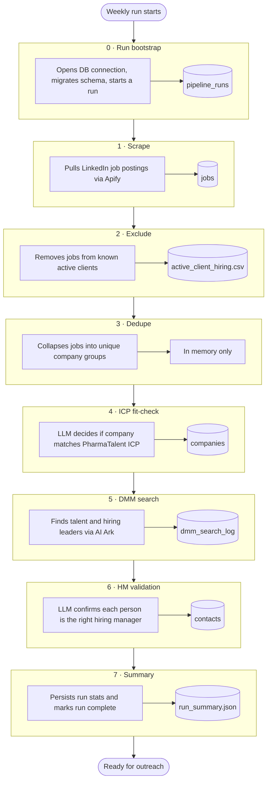
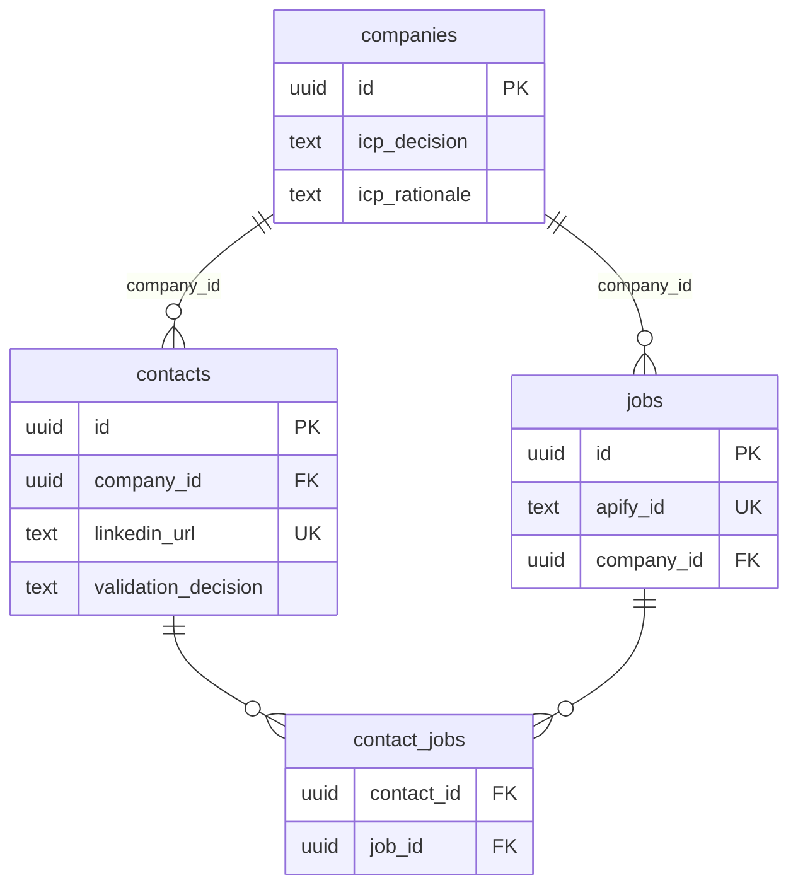

# PharmaTalent Europe — Lead Discovery Pipeline

**Time spent:** ~4 hours

Weekly lead-discovery pipeline for PharmaTalent Europe: scrape biotech/pharma jobs from LinkedIn, exclude active clients, ICP-fit companies via OpenRouter web research, find decision-makers via AI Ark, validate hiring managers via OpenRouter, persist to Supabase.

## Quick start

```bash
git clone https://github.com/cyborgsuh/Automindz-Assignment.git
cd Automindz-Assignment
python -m venv .venv
.venv\Scripts\activate          # Windows — use source .venv/bin/activate on macOS/Linux
pip install -e ".[dev]"
copy .env.example .env          # fill in credentials
python -m pipeline
```

Swap credentials by editing `.env` only — no code changes needed. Schema is applied automatically on first run ([pipeline/db/schema.sql](pipeline/db/schema.sql)).

```bash
python -m pipeline --fixture    # local fixtures, no Apify / AI Ark spend
```

## Environment variables

| Variable | Required | Purpose |
|---|---|---|
| `APIFY_TOKEN` | Yes (unless `--fixture`) | LinkedIn jobs scrape |
| `APIFY_MAX_ITEMS` | No | Jobs per scrape (default **2**) |
| `AI_ARK_TOKEN` | Yes (unless `--fixture`) | Decision-maker people search |
| `OPENROUTER_API_KEY` | Yes (unless `--fixture`) | LLM for ICP + HM validation |
| `OPENROUTER_ICP_MODEL` | No | Default `perplexity/sonar` |
| `OPENROUTER_ICP_FALLBACK_MODEL` | No | Default `openrouter/free` |
| `OPENROUTER_HM_MODEL` | No | Default `meta-llama/llama-3.1-8b-instruct` |
| `SUPABASE_POOLER_URL` | Yes | Postgres pooler URL from Supabase Connect dialog |

## Model choices

| Stage | Model | Why |
|---|---|---|
| ICP fit-check (primary) | `perplexity/sonar` + web plugin | Web research for company website content |
| ICP fit-check (fallback) | `openrouter/free` → `meta-llama/llama-3.1-8b-instruct` | On 402 / rate limits; uses LinkedIn metadata + homepage fetch |
| HM validation | `meta-llama/llama-3.1-8b-instruct` | Cheap, fast structured JSON per candidate |

## How the pipeline works

Each week the pipeline runs end-to-end. The diagram gives a quick overview; the table below lists every stage in detail.



| Stage | What it does | Writes to |
|---|---|---|
| 1 · Scrape | Apify LinkedIn jobs (7-day window, ICP titles/locations) | `jobs` |
| 2 · Exclude | Remove known active-client jobs | `output/active_client_hiring.csv` |
| 3 · Dedupe | Collapse jobs into unique companies | *(in memory)* |
| 4 · ICP fit-check | LLM company fit decision + rationale | `companies` |
| 5 · DMM search | AI Ark people search (max 2 per call, geo cascade) | `dmm_search_log` |
| 6 · HM validation | LLM keep/drop with reason | `contacts`, `contact_jobs` |
| 7 · Summary | Run stats | `output/run_summary.json` |

Reruns upsert on natural keys and reuse cached ICP/DMM/HM results — no duplicate rows.

## Data model



## Scope cuts

With another day: AI Ark MCP config (`mcp.json`), ICP decisions CSV export, two-pass Apify scrape for active-client hiring signals, and a hard AI Ark credit budget guard.

## License

MIT
